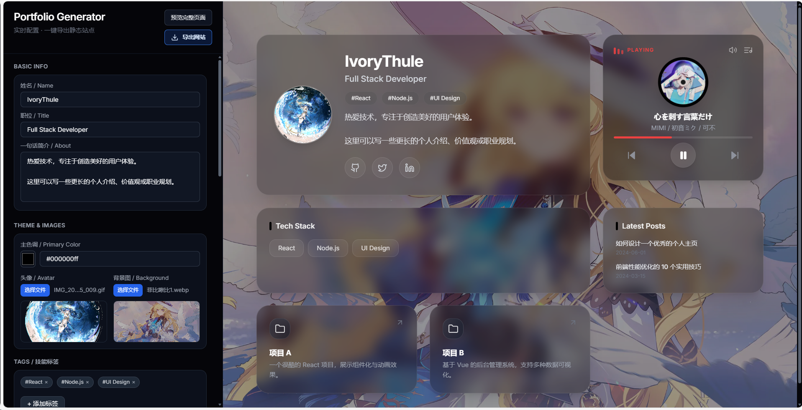

# visual-homepage-builder — Portfolio Generator & Templates

**Overview**

visual-homepage-builder contains multiple static portfolio templates and a visual "Portfol.io Generator" built with React + Vite. The generator enables users to create, preview and export a static personal homepage directly in the browser — no backend required.

---

## Demo

Below is a short GIF that demonstrates exporting a generated static site from the visual editor.


Also see a screenshot of the editor UI:



Place additional screenshots or assets in `assets/` or `docs/` and update paths as needed.

---

## Key Highlights

- WYSIWYG visual editor — edit, preview and export without touching code
- Modern Bento Grid + glassmorphism UI
- Client-side export: generates a deployable static HTML/CSS/JS ZIP
- Modular components: projects, tags, social links, avatar/background upload

---

## Quick Start (developer)

Requirements: Node.js 16+, npm or yarn

```powershell
cd .\portfolio-generator
npm install
npm run dev
```

Open `http://localhost:5173` in your browser. Build for production:

```powershell
npm run build
npm run preview
```

Build output: `portfolio-generator/dist/` (ready to deploy).

---

## Repo Snapshot

Key folders:

```
portfolio-generator/   # visual editor (React + Vite)
	├─ index.html
	├─ package.json
	├─ src/
	│  ├─ App.jsx
	│  ├─ main.jsx
	│  ├─ components/
	│  │  ├─ Editor.jsx
	│  │  ├─ Preview.jsx
	│  │  └─ music/
	│  │     ├─ MusicPlayer.jsx
	│  │     └─ playlist.js
	│  └─ utils/
	│     └─ generateZip.js
assets/                # screenshots (PNG) and demo GIF
```

---

## Contributing

Fork → feature branch → PR. Use descriptive commit messages and include testing steps in PR description.

---

## License

MIT — see `LICENSE` in the repository root.
