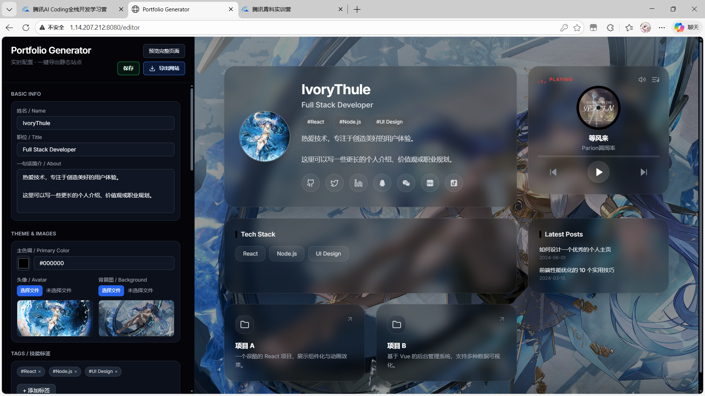
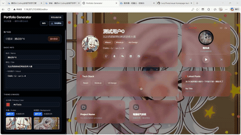

# Visual Homepage Builder — Visual editor + templates

This project provides a WYSIWYG visual editor (React + Vite) and several static portfolio templates. The editor lets users edit, preview and export a deployable static personal homepage; an optional backend provides registration/login and cloud-saving features.

---

## Demo & Screenshots

Editor screenshot:



Export demo GIF:



Place additional screenshots or assets in `MarkdownImages/` or `docs/` and update paths as needed.

---

## Key Features

- WYSIWYG visual editor — edit, preview and export without writing code
- Frontend: React + Vite + Tailwind, supports image upload, project cards, tags, built-in music player
- Backend (optional): Express + MySQL, provides registration/login, JWT auth and config save/load
- Client export: generates a ZIP containing static HTML/CSS/JS for easy deployment

---

## Quick Start (developer)

Requirements: Node.js 16+, npm

Start backend (optional — for registration/login and cloud save):

```powershell
cd .\backend
npm install
# configure .env (see below), then
npm run start
```

Default backend port: `3001` (override via `backend/.env`).

Start frontend:

```powershell
cd .\frontend
npm install
npm run dev
```

Open `http://localhost:5173` in your browser.

Build frontend for production:

```powershell
cd .\frontend
npm run build
# preview production build
npm --prefix frontend run preview
```

Build output: `frontend/dist/`.

---

## Repo Snapshot

Key folders:

```
frontend/   # visual editor (React + Vite)
backend/    # optional Express API
MarkdownImages/ # screenshots and demo GIFs used in README
legacy-templates/ # static templates used as export references
```

---

## Roadmap

- Music enhancements: integrate open music APIs and external playlist import
- Template marketplace: add more export templates and selection UI
- Export improvements: one-click deploy to GitHub Pages, domain/deploy guides
- Component marketplace: save/share reusable component configs
- Tests & CI: add unit/integration tests and GitHub Actions for build preview

---

## Contributing

Fork → branch → PR. Include testing steps and a clear description.

---

## License

MIT — see `LICENSE` in the repository root.
